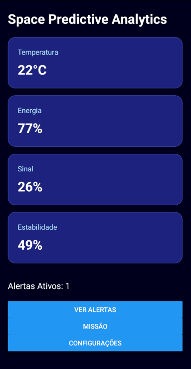
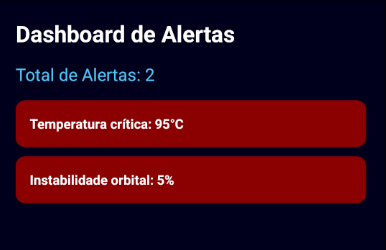
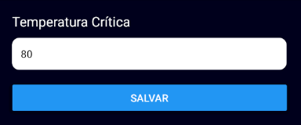

# Space Predictive Analytics

### Global Solution 2026.1 — Cross-Platform Application Development | FIAP

---

## Descrição

O Space Predictive Analytics é uma aplicação mobile desenvolvida para monitoramento inteligente de operações espaciais simuladas. A plataforma realiza o acompanhamento de indicadores críticos como temperatura, energia, comunicação e estabilidade orbital, gerando alertas automáticos sempre que valores ultrapassam limites configurados. A solução auxilia a tomada de decisão em ambientes críticos por meio da centralização e interpretação dos dados operacionais da missão.

---

## Equipe

| Nome | RM |
|--------|--------|
| Thiago Ono Sakai | RM563448 |
| Pedro Mitsuo Risardi Nisiaymamoto | RM561710 |

**Turma:** 2CCPO

---

## Telas do Aplicativo

### Home — Dashboard Principal



Visão geral da missão espacial com monitoramento dos principais indicadores de telemetria, incluindo temperatura, energia, qualidade do sinal e estabilidade orbital.

---

### Dashboard de Sensores


Monitoramento dos sensores da missão com atualização periódica dos dados simulados de temperatura e estabilidade operacional.

---

### Dashboard de Energia


Visualização dos indicadores de energia da missão, incluindo consumo atual e energia disponível para operação.

---

### Dashboard de Comunicação


Monitoramento da qualidade do sinal de comunicação entre a missão e a central de controle, identificando possíveis perdas ou degradações do link.

---

### Alertas



Tela responsável pela exibição dos alertas gerados automaticamente quando algum indicador atinge níveis críticos definidos pelo usuário.

---

### Configurações / Formulário



Formulário para configuração dos limites de alerta, com validação dos dados informados e persistência local utilizando AsyncStorage.

---

## Funcionalidades

- [x] Dashboard principal com indicadores em tempo real (simulado)
- [x] Dashboard de sensores
- [x] Dashboard de energia
- [x] Dashboard de comunicação
- [x] Sistema de alertas automáticos baseado em limiares críticos
- [x] Persistência de configurações utilizando AsyncStorage
- [x] Navegação utilizando Expo Router
- [x] Context API para gerenciamento global do estado da missão
- [x] Formulário com validação de dados
- [x] Atualização periódica dos dados simulados
- [x] Componentes reutilizáveis
- [ ] Integração com API externa (bônus)
- [ ] Integração com IA Generativa (bônus)

---

## Tecnologias Utilizadas

- React Native
- Expo
- Expo Router
- TypeScript
- Context API
- AsyncStorage
- React Hooks (useState, useEffect, useContext)
- Expo Go

---

## Estrutura do Projeto

```text
src/
│
├── app/
│   ├── _layout.tsx
│   ├── index.tsx
│   ├── alerts.tsx
│   ├── mission.tsx
│   └── settings.tsx
│
├── components/
│   ├── AlertCard.tsx
│   └── DashboardCard.tsx
│
├── context/
│   └── MissionContext.tsx
│
└── services/
    └── simulator.ts
````

---

## Como Executar

### Pré-requisitos

* Node.js instalado
* NPM instalado
* Expo Go instalado no dispositivo móvel ou emulador Android
* Android Studio (opcional)

### Instalação

Clone o repositório:

```bash
git clone https://github.com/Mitsuo100/-space-predictive-analytics.git
```

Acesse a pasta do projeto:

```bash
cd -space-predictive-analytics
```

Instale as dependências:

```bash
npm install
```

Execute o projeto:

```bash
npx expo start
```

Para abrir no Android:

```bash
npx expo start --android
```

Ou escaneie o QR Code utilizando o Expo Go.

---

## Sistema de Alertas

A aplicação monitora continuamente os seguintes indicadores:

* Temperatura
* Energia
* Qualidade do sinal
* Estabilidade orbital

Quando um valor ultrapassa os limites configurados, um alerta é gerado automaticamente e exibido na tela de monitoramento.

---

## Persistência de Dados

As configurações dos limiares de alerta são armazenadas localmente utilizando AsyncStorage, permitindo que as preferências do usuário permaneçam salvas mesmo após o fechamento da aplicação.

---

## Repositório

GitHub:

https://github.com/Mitsuo100/-space-predictive-analytics

---

## Projeto Acadêmico

Projeto desenvolvido para a disciplina **Cross-Platform Application Development** da FIAP como parte da avaliação **Global Solution 2026.1**.

Desenvolvido por:

* Thiago Ono Sakai
* Pedro Mitsuo Risardi Nisiaymamoto

```
```
